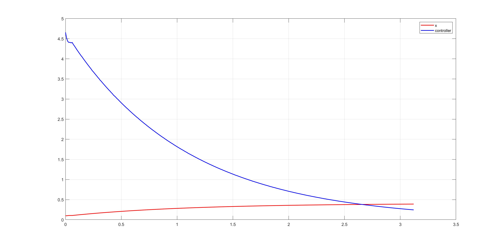
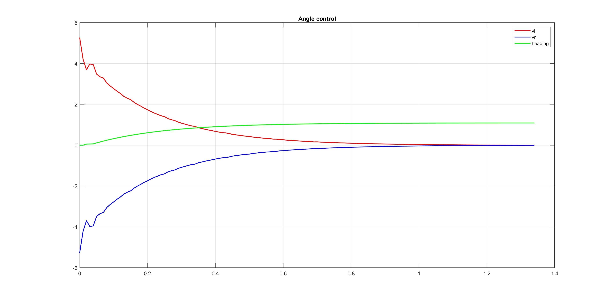
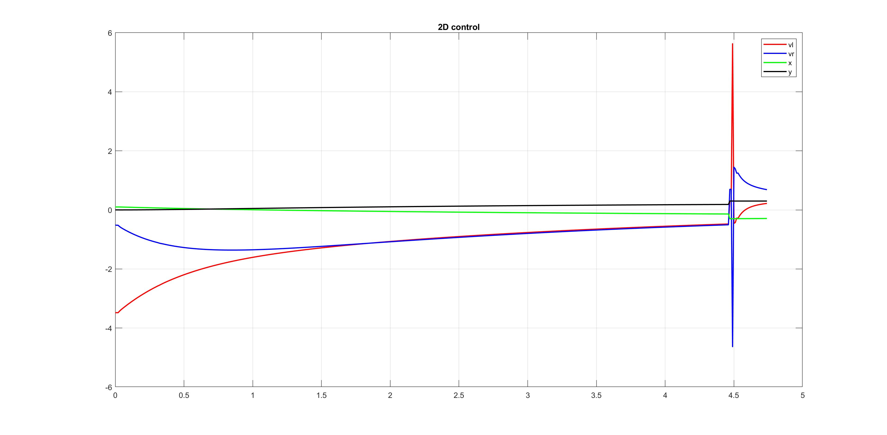

# Digital LAB HW

## One direction control

### Codes functionallity
In the code designed for controlling the robot in one direction (X), a PID controller class is used, So all 4 types of controllers (P, PI, PD, PID) are attainable by changing the gains in objects created from this class.
This class uses a member variable called sample-time, as soon as delta-time reaches the sample-time, it calculates the PTerm, the DTerm (deviding the error by delta-time) and the ITerm (using error summation) and defines the output as the sum of all this terms.

### P, PI, PD, PID
A P controller output is proportional to the error its input by a kp gain, so there is no Overshoot. A PI controller uses an integrator to reduce the steady state error. A PD contoller uses a derivative block to decrease the setteling time of the process. A PID contoller is mixture of all the controllers explained above and can be used to achieve critically damped response with minimum final error. 

### Discretization
For disceteization of every section of the PID contoller we can use the ZOH method, which consists of sampler with specific frequency.

### Deadzone
Deadzones causes the process error to become larger (the motor does not respond until the input gets to a specific value). for example if the deadzone bound for our DC motor is 0.5 and we use a P contorller with kp=10, the errors lower than 0.05 correspond to a value lowers than 0.5 for motor input.

### Anti Wind-Up gaurd
Integerator Wind-Up can cause the PID output to exceed the upper (or lower) saturation bound for motor input. A member variable called windup_guard is introduced to prevent this from happening.

 
In the above picture, you can see the controllers output and X-position of the robot for the introduced object of the PID class.

## Angle control

### Codes functionallity
In the code designed for controlling the Angle of the robot, the same PID class is used. the desired output for heading is constantly being checked with the feedback (heading) to reach the desired output.

 
In the above picture, you can see the motors input and compass readings of the robot, which is being controlled with an object of the PID class.
The remaining parts are the same as previous sections.

## 2D control

### Codes functionallity
In this code, position of the robot is controlled with two objects from the same PID class, one for the distance between the robot and desired position and one for the angle difference. Robot motors use the formula derived in the class the desired (`vr=(2v+Lw)/2R` and `vl=(2v-Lw)/2R`) to move the robot to the desired X abd Y.

 
In the above picture, you can see the motors input and the pposition of the robot.
The remaining parts are the same as previous sections.

## Ball tracking

### Codes functionallity
In this code, 3 objects of the PID controller rotate the robot so the ball is in fornt of it by increaing FrontBack parameter if its lower than -0.6 (`ball_bata["direction"][0]`) ,reduce robot angle with the ball (`ball_bata["direction"][1]`) and increase the disatnce parameter (`ball_bata["strength"]`) which is being feed to the controller as 1/distance. Robot motors use the formula derived in the class (`vr=(2v+Lw)/2R` and `vl=(2v-Lw)/2R`) in which v is the distance controller output and w is the theta controller output

 
In the above picture, you can see the motors input and the pposition of the robot.
The remaining parts are the same as previous sections.
